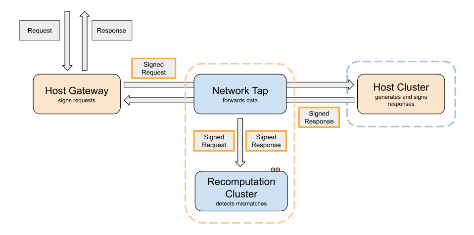

# Inference Verification

A prototype demo for verifying LLM inference. This system is split into several FastAPI backends together with a Svelte dashboard.



## Getting started

### Requirements

- [pnpm](https://pnpm.io/)
- [uv](https://docs.astral.sh/uv/)
- [Docker](https://www.docker.com/) for local VLLM inference, optional

### Install

```bash
pnpm add -g concurrently
```

### Run

```bash
./run-dev.sh
```

`run-dev.sh` uses `concurrently` to start every service plus the dashboard:

| Service               | Port |
| --------------------- | ---- |
| dashboard             | 5173 |
| Host Gateway          | 8010 |
| Network Tap           | 8020 |
| Host Cluster          | 8030 |
| Recomputation Cluster | 8040 |

## Inference backend

### Real inference (vLLM in Docker)

To run against an actual model, set `MOCK_INFERENCE=false` in `.env`.

```bash
# To install
docker pull vllm/vllm-openai-cpu:v0.22.0-x86_64
docker create \
    -v ~/.cache/huggingface:/root/.cache/huggingface \
    -v ~/.cache/vllm:/root/.cache/vllm \
    -e KMP_TOPOLOGY_METHOD=flat \
    -e HF_TOKEN=$HF_TOKEN \
    -p 8080:8000 \
    --name vllm \
    vllm/vllm-openai-cpu:v0.22.0-x86_64 \
    google/gemma-3-270m-it \
    --gpu-memory-utilization 0.3 \
    --max-model-len 1000
```

```bash
# To run
docker start -i vllm
```

<details> <summary>Notes</summary>

- Set `HF_TOKEN` for faster downloads
- `KMP_TOPOLOGY_METHOD=flat` avoids `Assertion failure at kmp_affinity.cpp`
  errors when run in sandboxes.

</details>
